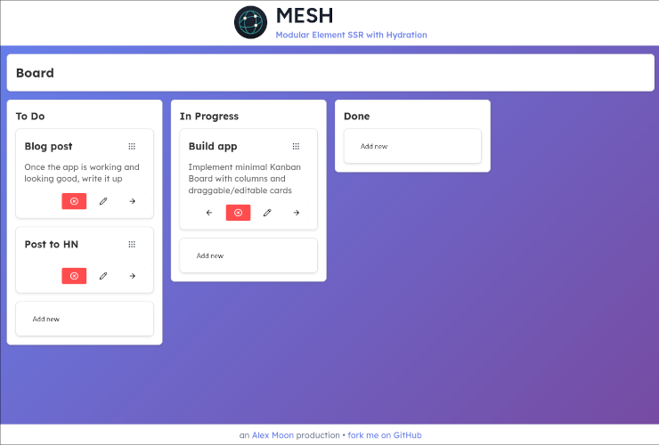

# MESH
**Modular Element SSR with Hydration**



MESH is a fun project intending to demonstrate the kinds of concepts
embodied by [HTMX](https://htmx.org/) - without using HTMX. Specifically,
we're rendering modular elements on the server, and hydrating them on
the client, swapping them out as needed instead of reloading the whole page.

Component updates are swapped in place. Out-of-band updates are sent
to all connected clients via SSE, meaning all users see updates in
real time.

## Tech stack

The back-end is written in Go, using a couple of libraries to keep
the code relatively minimal. Specifically, we use
[net/http](https://pkg.go.dev/net/http) to host both static files
and components generated with [a-h/templ](https://templ.guide/). We also use
[r3labs/sse](https://github.com/r3labs/sse) for SSE handling.

The front-end is written in TypeScript and SCSS. Apart from
[Lucide](https://lucide.dev/) for icons, we're not using any libraries on the
front-end - just good old fashioned
[Web Components](https://developer.mozilla.org/en-US/docs/Web/API/Web_components)
and [EventSource](https://developer.mozilla.org/en-US/docs/Web/API/EventSource).

## Local dev

### Prerequisites

The Makefile assumes you have [Docker Compose](https://docs.docker.com/compose/)
(and, of course, [Make](https://www.gnu.org/software/make/)) installed on your system.
If you don't have or don't want to use either of these, you should still be able
to get the project running by simply running air (not tested, ymmv etc.):
```
go mod download
go install github.com/air-verse/air@v1.61.7
go install github.com/a-h/templ/cmd/templ@v0.3.898
air -c .air.toml
```

### With docker-compose

First, build the service for local dev - you only need to do this once:
```
make build
```

Now, run the docker containers - this puts the service behind a simple
nginx proxy for SSL, mimicking a production deployment:
```
make run
```

You should see MESH running at https://localhost/ - simply accept the
self-signed certificate in your browser.

The local app will watch file changes and rebuild both Go and Node automatically. There
is no database - all data is stored in memory - so your board will reset on every
rebuild.

## Contributions

There is a lot of work that could be done to clean this code base up and make it
leaner and more reliable. I'm satisfied that it proves the concept, so I won't be
doing any further development on it.

However, if you'd like to submit a pull request, I will happily take a look.
